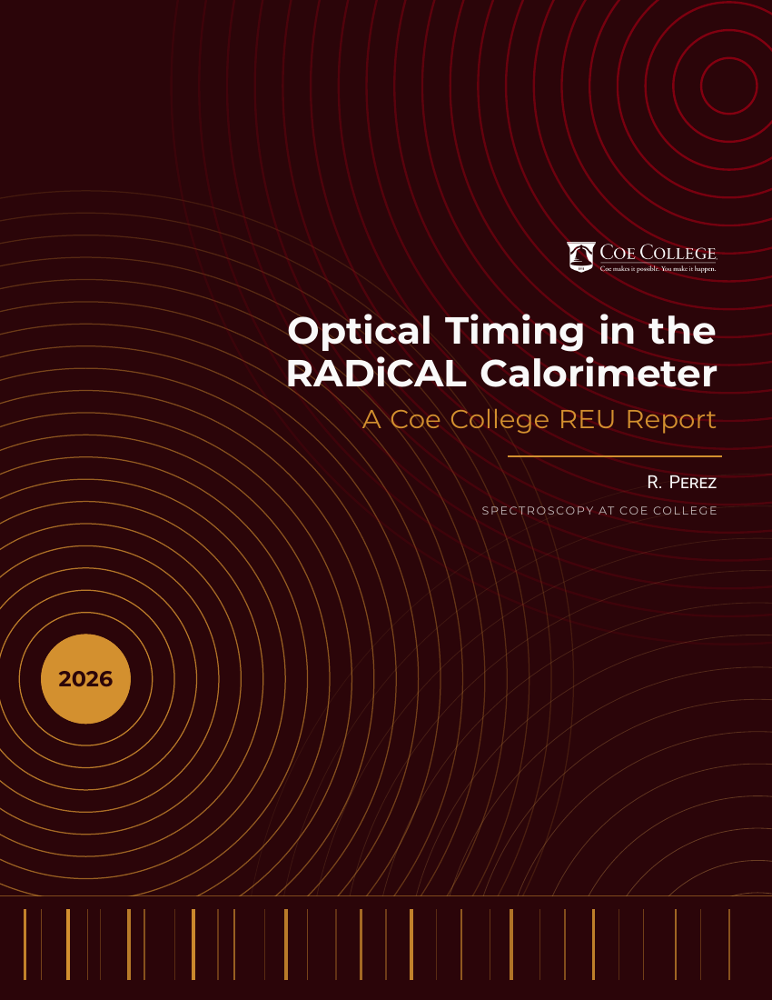

# Coe College Summer REU — LaTeX Report Template

A LaTeX template for writing up summer research at Coe College, branded in Coe
crimson and gold. Use it for REU reports, symposium write-ups, or any project
report where you want something that looks deliberate.

If you'd rather not use LaTeX, you don't have to — this template exists for
students who want it, not as a requirement.

<p align="center">
  
</p>

---

## Quick start

### On Overleaf (easiest)

1. Import this repository into Overleaf, or upload the files to a new project.
2. Set the **main document** to `main.tex`.
3. Set the **compiler** to **pdfLaTeX** (Menu → Compiler). This is not optional
   — see [Requirements](#requirements).
4. Press Recompile.

### Locally

You need a full TeX distribution (MacTeX, TeX Live, or MiKTeX). Then:

```bash
pdflatex main.tex && biber main && pdflatex main.tex && pdflatex main.tex
```

Three `pdflatex` passes are the minimum. The cover and section markers use TikZ
`remember picture`, the mini table of contents uses `titletoc`, and the
bibliography uses `biblatex` — each needs the pass before it to have already
run. Fewer passes gives you a cover with misplaced art and empty page numbers.

Or just use `latexmk`, which figures the passes out for you:

```bash
latexmk -pdf main.tex
```

---

## Setting up your report

Everything you normally need is in the first 25 lines of `main.tex`.

```latex
\pretitle
{Optical Timing in the RADiCAL Calorimeter} % Main title
{A Coe College REU Report}                  % Subtitle
{R. Perez}                                  % Your name

\renewcommand{\reportNumber}{1}
\renewcommand{\reportKicker}{Coe College REU}
\renewcommand{\coeProgram}{Spectroscopy at Coe College}
```

| Command | What it controls | Default |
|---|---|---|
| `\pretitle{…}{…}{…}` | Cover title, subtitle, author | — |
| `\reportNumber` | The large numeral on the chapter page | `1` |
| `\reportKicker` | Rotated spine label and the running header | `Coe College REU` |
| `\coeProgram` | Program line on the cover and in the footer | `Spectroscopy at Coe College` |
| `\coeLogoFile` | Cover wordmark image | `Coe_Logo_Inverse.png` |

All of these have defaults, so override only what you need. The year on the
cover is filled in automatically.

**One structural requirement:** the mini table of contents on the chapter page
needs `\startcontents[sections]` to appear before your first `\chapter{}`. It's
already in `main.tex` — don't delete it, or the chapter page comes out with an
empty summary box.

---

## Writing

### Results boxes

```latex
\begin{results}[Optional label shown next to the title]
    Your text here. The box breaks across pages automatically.
\end{results}
```

### Highlighted equations

```latex
\begin{keyresult} \label{eq: key}
    \sigma_t = \frac{a}{\sqrt{E}} \oplus b
\end{keyresult}
```

Note the label goes *inside* the environment.

### Other commands

| Command | Effect |
|---|---|
| `\divider` | Horizontal rule for separating passages |
| `\therefs\cite{key}` | "References:" line — for indirect citations |
| `\textcite{key}` | Inline citation — "as shown by Author (2024)" |
| `\Acomment{text}` | Curly-quoted italic aside |
| `\eq` / `\noeq` | Inside `align`, draws connecting lines between `=` signs |
| `\vec{v}` | Bold vector notation instead of an arrow |
| `\boldone` | Blackboard-bold identity/unit symbol |

Put your citations in `bib.bib`.

---

## Branding

The palette is at the top of `coereu.cls` under **COLOR SETTINGS**.

| Colour | Hex | Used for |
|---|---|---|
| `coeCrimson` | `#880011` | Headings, links, equation tags |
| `coeGold` | `#d3902f` | Cover geometry, rules, box frames |
| `coeLightGold` | `#DAA252` | Accents |
| `coeInk` / `myDColor` | `#2B0509` | Cover ground, chapter blocks |
| `coePaper` | `#F9F9F9` | Type on dark backgrounds |

Typography is **Montserrat** for headings and **Roboto** for body text, matching
the two families coe.edu actually loads. To switch the body back to a serif,
delete the `[sfdefault]` option from the `roboto` line in `coereu.cls`.

> **Before you print anything:** the crimson and gold above were read from Coe's
> own production stylesheet, because Coe does not publish its brand guide
> publicly. They are **web values** — no Pantone or CMYK build is published
> anywhere. If your report is going to a printer, confirm the print colours and
> the logo usage rules with the Office of Marketing (`o-marketing@coe.edu`),
> whose brand assets live behind the My Coe login.

The cover uses the official white knockout wordmark (`Coe_Logo_Inverse.png`).
`Coe_Logo.png` is the standard crimson version, for use on light backgrounds —
it will be invisible on the dark cover.

---

## Requirements

**pdfLaTeX or LuaLaTeX only — not XeLaTeX.** The rotated spine label uses
`\textls` (microtype letterspacing), which XeLaTeX does not support. The build
fails immediately under it.

Bibliography needs **biber**, not bibtex.

Beyond a standard full TeX install, the class pulls in `tcolorbox`, `biblatex-ext`,
`physics`, `tensor`, `stmaryrd`, `dsfont`, `bbold`, `pgfplots`, `montserrat`,
and `roboto`. All ship with full TeX Live and are present on Overleaf. A minimal
install (BasicTeX) will need them added.

---

## Known quirks

Inherited from the original template, documented here so they don't surprise you:

- **`\section*{}` does not work.** The class redefines `\section` to always be
  unnumbered, and the redefinition swallows the `*`. Just use `\section{}`.
- **`\ref{}` to a section gives the wrong number**, because sections are
  unnumbered. Use `\nameref{}` instead, which prints the section title.
- **Chapters do not start a new page.** The class deliberately patches this out
  so the cover isn't followed by a blank. With multiple chapters they run on
  inline; add `\clearpage` yourself if you want the break.
- **The bibliography always prints**, even with no citations, so a report with
  no references still gets a References section.
- **`physics` and `siunitx` conflict.** Both define `\qty`. If you need
  `siunitx` for units, remove `\RequirePackage{physics}` from `coereu.cls`.

---

## Files

| File | What it is |
|---|---|
| `main.tex` | Your document — edit this |
| `coereu.cls` | The class: layout, colours, cover, environments |
| `bib.bib` | Your bibliography |
| `Coe_Logo_Inverse.png` | White knockout wordmark (cover) |
| `Coe_Logo.png` | Crimson wordmark (light backgrounds) |
| `preview.png` | Cover render, for this README |

---

## Credits

Coe College REU branding and layout adapted from *A soft template for homework
solutions* by **Lucas R. Ximenes (Jimeens)**.

The original template's license is reproduced below in full, and its terms
apply to this version as well — in particular, **it may not be sold**, in
original or modified form.

---

## License

```
Copyright (c) Lucas R. Ximenes 2023

Permission is hereby granted, free of charge, to any person obtaining a copy of
this template and associated documentation files (the "Homework Solutions
template"), to use the Template without restriction, including without
limitation the rights to use, modify, merge and distribute copys of the
Template, and to permit persons to whom the Template is furnished to do so,
subject to the following conditions:

1. If you don't mind, it would be nice to add it somewhere in the file
   "Template by Lucas R. Ximenes"

2. YOU MAY NOT SELL THE TEMPLETE, or any modified version of it.

For support or inquiries, please contact lcsximenes@usp.br.
```
